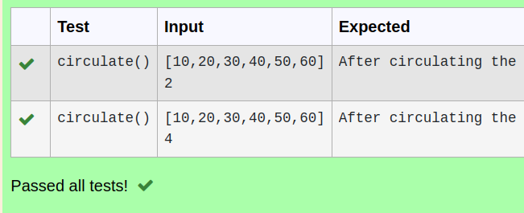

# Circulate-the-values-of-N-variables
Aim:
To write a python program to circulate the n variables using function concept
Equipment’s required:

PC Anaconda - Python 3.7
Algorithm:
Step 1:

Import def circulate
Step 2:

Prepare the lists from each linear equations
Step 3:

Get the value from the user for the number of rotation
Step 4:

Using the slicing concept rotate the list
Step 5:

Print the values it would be criculated
Step 6:

End the programm
## Program:
```python

#Program to circulate N values.
#Developed by:Aadithyan R
#RegisterNumber:22000618
def circulate():
    a=eval(input())
    n=int(input())
    m=a[n:]+a[:n]
    print('After circulating the values are:',m)
```

## Output:


## Result:
this program is to circulate the variables of N variables.
